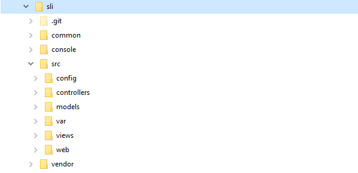

## Slim4-Mod auto-route

**Tác giả:** Phi Hùng - vmkeyb908@gmail.com - (VN) 0974 471 724

---

Slim4-MVC tiny and faster MVC framework for PHP

Các bổ sung và hiệu chỉnh là tối thiểu dể bạn có thể sử dụng MVC với slim4.

>
>*Đặc biệt:* 
>	* Nó sẽ nạp các route với tính chất động (dynamic) mỗi khi người dùng gõ vào một URL nào đó. Do vậy hệ thống sẽ hoạt động nhanh và ít tốn bộ nhớ vì không mất qui trình "init" chưa cần dùng đến.   
>	* View mặc định là PHP, bạn có thể dùng Smary (đặt phần mở rộng của view là .tpl) hoặc Twig (.twig) - Hệ thống sẽ nạp code động (lazy-dynamic load) khi bạn sử dụng một trong các loại kết xuất "view".
>

---

**Cài đặt:**

```markdown

* Cai dat lan dau:

composer create-project slim4-mod/mvc:"dev-master"  your-slim-project-name

* Hoac dong lenh duoi day neu ban da cai dat lan dau:

composer require slim4-mod/mvc "dev-master"

```

##### * Cau hinh Apache, them vao httpd-vhosts.conf :


```

<VirtualHost *:80>
    ServerName tmp.local
    ErrorLog "logs/tmp.local-error.log"
    CustomLog "logs/tmp.local-access.log" common
	
    DocumentRoot "${SRVROOTV}/tmp/src/web"
	<Directory "${SRVROOTV}/tmp/src/web">
		Options Indexes FollowSymLinks
		AllowOverride None
		Require all granted
		
		RewriteCond %{REQUEST_FILENAME} !-f
        RewriteCond %{REQUEST_FILENAME} !-d
        RewriteRule ^ index.php [L]
		FallbackResource /index.php
	</Directory>
</VirtualHost>

```

##### Ảnh cấu trúc thư mục:



##### Cách sử dụng:

>
>Dùng tiện ích dòng lệnh để tự động tạo cấu trúc file cần thiết cho model mới (NEW_MODEL).
>
> ```
> new-model <tên_model_mới>
> ```
>
>Sau khi chạy tiện ích xong bạn có thể gõ 'localhost/NEW_MODEL' vào trình duyệt để thử ngay.
>
>Muốn tham khảo đủ tính năng, bạn cần làm 2 việc chính để sử dụng như MVC-framework:
>
>* 1- Đến thư mục src/models/NEW_MODEL và thiết kế bổ sung ORM cho file NEW_MODEL.php
>
>* 2- Tạo bảng tương thích với NEW_MODEL.
>
> 

* Qui định bắt buộc:
	- Cấu trúc thư mục như slim4 mẫu đang có. Tất cả thư mục là chữ thường, các file (class) là chữ cái đầu in hoa.
	- Tên các chức năng của "Product" phải có chữ đầu tiên là viết in hoa và nối phía sau là Action (ex: ListAction.php, RowAction.php, ...)

*Chạy thử:* Bạn có thể gõ các địa chỉ thử nghiệm như dưới.

* Liệt kê toàn bộ bảng product:
	- localhost/product/list
		
* Xem thông tin một hảng (có id=2):
	- localhost/product/row/2
		
* Xem product/index:
	- localhost/product
	
* v.v...

>
> *Chú thich:* Các tính năng đang trong quá trình thiết kế do vậy cần sự đóng góp của mọi người. Thanks!
>

*Tác giả: Phi-Hùng - vmkeyb908@gmail.com - Readme v.1.0*